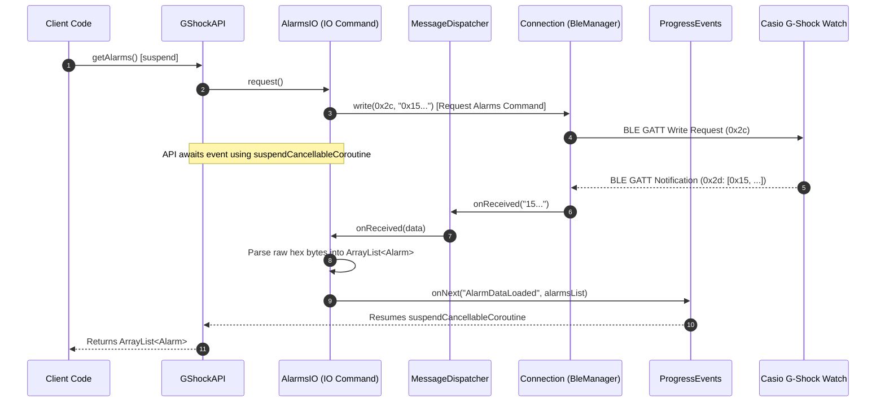
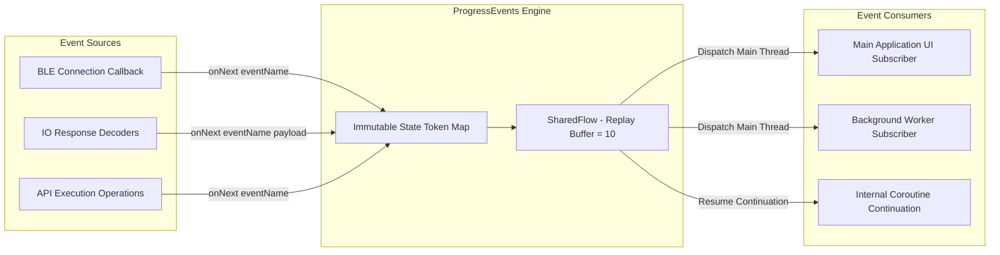

# GShockAPI Technical Overview & Architecture Specification

## 1. Executive Technical Summary

**GShockAPI** is an Android Kotlin library providing a structured, coroutine-based API for Bluetooth Low Energy (BLE) communication with Casio G-Shock watches (e.g., GW-B5600, DW-B5600, G-B001, ABL-100WE, ECB-30, MTG-B1000).

The library encapsulates low-level Casio GATT characteristic interactions, hex protocol encoding/decoding, time zone conversions, and device discovery into a high-level API.

---

## 2. Component Architecture & System Topology

### 2.1 Component Relationships

The diagram below illustrates the structural relationships between the application layer, public facade, IO command handlers, message dispatcher, BLE connection layer, and the reactive event bus.

```mermaid
graph TD
    subgraph Client Application Layer
        App[Android App / Activity / Service]
    end

    subgraph Facade Layer
        IGShockAPI[<<i>IGShockAPI</i>>]
        GShockAPI[GShockAPI Facade]
        GShockAPIMock[GShockAPIMock]
        IGShockAPI <|.. GShockAPI
        IGShockAPI <|.. GShockAPIMock
    end

    subgraph Event Engine
        ProgressEvents[ProgressEvents Event Bus]
        SharedFlow[MutableSharedFlow]
        ProgressEvents --- SharedFlow
    end

    subgraph Protocol & Dispatch Layer
        MessageDispatcher[MessageDispatcher]
        CasioConstants[CasioConstants & UUIDs]
        CasioTZ[CasioTimeZoneHelper]
    end

    subgraph Command & IO Layer
        IO[IO Functional Base]
        TimeIO[TimeIO / GwBx5600TimeIO]
        AlarmsIO[AlarmsIO]
        EventsIO[EventsIO]
        SettingsIO[SettingsIO]
        StepCounterIO[StepCounterIO]
        TimerIO[TimerIO]
        OtherIOs[WorldCitiesIO / AppInfoIO / etc.]

        IO <|-- TimeIO
        IO <|-- AlarmsIO
        IO <|-- EventsIO
        IO <|-- SettingsIO
        IO <|-- StepCounterIO
        IO <|-- TimerIO
        IO <|-- OtherIOs
    end

    subgraph BLE & Transport Layer
        Connection[Connection Lifecycle Manager]
        IGShockManager[IGShockManager Interface]
        GShockScanner[GShockScanner]
        GShockPairing[GShockPairingManager / Companion Device]
        NordicBLE[NordicSemi BleManager]

        IGShockManager <|.. Connection
        Connection --> NordicBLE
        Connection --> GShockScanner
        Connection --> GShockPairing
    end

    subgraph Hardware Layer
        Watch[Casio G-Shock Watch]
    end

    %% Wiring
    App --> IGShockAPI
    App ..> ProgressEvents : Subscribes to events
    GShockAPI --> Connection
    GShockAPI --> ProgressEvents
    Connection --> MessageDispatcher
    MessageDispatcher --> IO
    IO --> Connection : Sends raw byte arrays
    IO --> ProgressEvents : Emits parsed data
    NordicBLE <==>|GATT Read / Write / Notify| Watch
```

---

### 2.2 Async Request-Response Data Pipeline

Communication with Casio watches is asynchronous and packet-based. Requests are written to the GATT request characteristic (`0x2c`), while responses arrive asynchronously via notifications on characteristic `0x2d` or `0x30`.



---

### 2.3 Reactive Event Bus Architecture

`ProgressEvents` decouples library state notifications from caller execution contexts using Kotlin `MutableSharedFlow`.



---

## 3. Package & Module Structure

The library is organized under the root package `org.avmedia.gshockapi`:

```text
api/src/main/java/org/avmedia/gshockapi/
├── Alarm.kt                      # Alarm data entity & collection helpers
├── AppNotification.kt            # Rich notification data payload structure
├── DeviceInfo.kt                 # Discovered BLE device metadata
├── Event.kt                      # Reminder/Event entity & JSON parsing logic
├── EventDate.kt                  # Year/Month/Day date container for events
├── EventPeriod.kt                # Recurrence rules & mask enumerations
├── GShockAPI.kt                  # Main production implementation of IGShockAPI
├── GShockAPIMock.kt              # Mock implementation for unit tests & previews
├── ICDPDelegate.kt               # Companion Device Pairing callback interface
├── IGShockAPI.kt                 # Primary public interface specification
├── ProgressEvent.kt              # Central reactive event bus (ProgressEvents)
├── Settings.kt                   # Watch configuration parameters data class
├── WatchInfo.kt                  # Watch model capability matrix & definitions
│
├── ble/                          # BLE Management & Connection Lifecycle
│   ├── Connection.kt             # Main BLE GATT client implementation
│   ├── GShockPairingManager.kt   # Companion Device Manager association logic
│   ├── GShockScanner.kt          # Bluetooth LE foreground & background scanner
│   ├── IDataReceived.kt          # Low-level BLE data reception callback interface
│   └── IGShockManager.kt         # Connection abstraction interface
│
├── casio/                        # Protocol Specification & Message Routing
│   ├── Alarms.kt                 # Protocol constants for alarm slots
│   ├── CasioConstants.kt         # Service UUIDs, Characteristic UUIDs & Codes
│   ├── CasioTimeZoneHelper.kt    # Timezone index to Casio city code mapping
│   ├── MessageDispatcher.kt      # Routing table for inbound & outbound packets
│   └── ReminderMasks.kt          # Bitmask helpers for recurring reminder dates
│
├── io/                           # Command Encoders and Response Decoders
│   ├── IO.kt                     # Base command abstraction & WatchButton definitions
│   ├── AlarmsIO.kt               # Read/Write 5 watch alarms & hourly chime
│   ├── AppInfoIO.kt              # Read app information strings from watch
│   ├── AppNotificationIO.kt      # Encode & transmit display notifications
│   ├── ButtonPressedIO.kt        # Decode watch button trigger types
│   ├── CachedIO.kt               # In-memory caching wrapper for slow watch queries
│   ├── DstForWorldCitiesIO.kt    # Daylight Saving Time per world city
│   ├── DstWatchStateIO.kt        # Global watch DST state
│   ├── ErrorIO.kt                # Handle watch error responses (0xFF)
│   ├── EventsIO.kt               # Read/Write 5 watch reminders/events
│   ├── GwBx5600TimeIO.kt         # Specific time encoder for GW-B5600 series
│   ├── HomeTimeIO.kt             # Read home time city setting
│   ├── MtgB1000TimeIO.kt         # Specific time encoder for MTG-B1000 series
│   ├── RunActionsIO.kt           # Phone Finder & action trigger decoder
│   ├── SettingsIO.kt             # Basic watch settings (button sound, light, format)
│   ├── StepCounterIO.kt          # Read step count data (ABL-100WE / activity models)
│   ├── TimeAdjustmentIO.kt       # Auto-time synchronization config
│   ├── TimeIO.kt                 # Clock time read/write commands
│   ├── TimerIO.kt                # Countdown timer value getter/setter
│   ├── UnknownIO.kt              # Fallback decoder for unhandled messages
│   ├── WaitForConnectionIO.kt    # Connection initialization handshake
│   ├── WatchConditionIO.kt       # Battery level and watch condition decoder
│   ├── WatchNameIO.kt            # Model name query decoder
│   └── WorldCitiesIO.kt          # World city name and offset decoder
│
└── utils/                        # System & Format Utilities
    ├── Utils.kt                  # Hex-string <-> ByteArray conversions & JSON helpers
    └── WatchDataListener.kt      # Utility flow listener for raw watch byte stream
```

---

## 4. Complete Public API Reference (`IGShockAPI`)

All operations are exposed via the [`IGShockAPI`](file:///home/izivkov/projects/GShockAPI/api/src/main/java/org/avmedia/gshockapi/IGShockAPI.kt) interface implemented by [`GShockAPI`](file:///home/izivkov/projects/GShockAPI/api/src/main/java/org/avmedia/gshockapi/GShockAPI.kt).

### 4.1 Connection Lifecycle & Initialization

| Method Signature | Return Type | Description |
| :--- | :--- | :--- |
| `suspend fun waitForConnection(deviceId: String? = "")` | `Unit` | Connects to a watch. If `deviceId` is provided, connects directly by MAC address; otherwise initiates discovery. |
| `suspend fun init(): Boolean` | `Boolean` | Runs post-connection initialization (queries watch model name, capabilities, and button state). |
| `fun isConnected(): Boolean` | `Boolean` | Returns `true` if active BLE GATT connection is maintained. |
| `fun disconnect()` | `Unit` | Gracefully terminates active BLE connection. |
| `fun teardownConnection(device: BluetoothDevice)` | `Unit` | Low-level teardown of GATT link for specific device. |
| `fun close()` | `Unit` | Releases all underlying BLE resources and closes scan channels. |
| `fun preventReconnection(): Boolean` | `Boolean` | Flag check to prevent automated background reconnection loops. |
| `fun isBluetoothEnabled(context: Context): Boolean` | `Boolean` | Validates if system Bluetooth adapter is enabled. |
| `fun validateBluetoothAddress(address: String?): Boolean` | `Boolean` | Returns `true` if input is valid MAC address format (`AA:BB:CC:DD:EE:FF`). |

---

### 4.2 Device Pairing & Discovery API

| Method Signature | Return Type | Description |
| :--- | :--- | :--- |
| `fun associate(context: Context, delegate: ICDPDelegate)` | `Unit` | Triggers Android Companion Device Manager chooser flow for secure pairing. |
| `fun disassociate(context: Context, address: String)` | `Unit` | Removes Companion Device Manager association for specified MAC address. |
| `fun getAssociations(context: Context): List<String>` | `List<String>` | Returns list of associated watch MAC addresses. |
| `fun getAssociationsWithNames(context: Context): List<Association>` | `List<Association>` | Returns paired watches with stored display names. |
| `fun scan(context: Context, filter: (DeviceInfo) -> Boolean, onDeviceFound: (DeviceInfo) -> Unit)` | `Unit` | Starts active BLE foreground scanning with filter callback. |
| `fun stopScan()` | `Unit` | Halts active BLE scan. |
| `fun startFallbackScan(context: Context, addresses: List<String>, pendingIntent: PendingIntent)` | `Unit` | Background scan using `PendingIntent` for target MAC addresses. |
| `fun startObservingDevicePresence(context: Context, address: String)` | `Unit` | (Android 12+) Enables system presence observation for auto-reconnect. |
| `fun stopObservingDevicePresence(context: Context, address: String)` | `Unit` | (Android 12+) Stops system presence observation. |

---

### 4.3 Watch Identification & Telemetry

| Method Signature | Return Type | Description |
| :--- | :--- | :--- |
| `suspend fun getWatchName(): String` | `String` | Returns model name string (e.g., `"GW-B5600"`). |
| `suspend fun getBatteryLevel(): Int` | `Int` | Returns battery charge percentage (`0` to `100`). |
| `suspend fun getWatchTemperature(): Int` | `Int` | Returns internal sensor temperature in °C. |
| `suspend fun getStepCount(): Int` | `Int` | Returns daily step count (supported on ABL-100WE / activity models). |
| `suspend fun getAppInfo(): String` | `String` | Retrieves internal firmware/app build metadata from watch. |
| `suspend fun getError(): String` | `String` | Fetches last error message returned by watch firmware. |
| `suspend fun getPressedButton(): IO.WatchButton` | `WatchButton` | Identifies which button physical press initiated connection. |
| `fun isActionButtonPressed(): Boolean` | `Boolean` | `true` if connected via short-press of lower-right action button. |
| `fun isNormalButtonPressed(): Boolean` | `Boolean` | `true` if connected via long-press of lower-left connection button. |
| `fun isAlwaysConnectedConnectionPressed(): Boolean` | `Boolean` | `true` if connected using always-connected pattern. |
| `fun isAutoTimeStarted(): Boolean` | `Boolean` | `true` if connection was triggered automatically by scheduled auto-time update. |
| `fun isFindPhoneButtonPressed(): Boolean` | `Boolean` | `true` if connected via "Find Phone" long-press trigger. |

---

### 4.4 Time & World City Synchronization

| Method Signature | Return Type | Description |
| :--- | :--- | :--- |
| `suspend fun setTime(timeZone: String = TimeZone.getDefault().id, timeMs: Long? = null)` | `Unit` | Synchronizes watch RTC clock with phone time & specified timezone. |
| `suspend fun getHomeTime(): String` | `String` | Returns name of primary Home City configured on watch. |
| `suspend fun getWorldCities(cityNumber: Int): String` | `String` | Fetches configured city name for slot index (`0` to `5`). |
| `suspend fun getDSTForWorldCities(cityNumber: Int): String` | `String` | Returns DST status string for city slot (`0` to `5`). |
| `suspend fun getDSTWatchState(state: IO.DstState): String` | `String` | Fetches global watch DST configuration state. |

---

### 4.5 Alarms & Reminders Management

| Method Signature | Return Type | Description |
| :--- | :--- | :--- |
| `suspend fun getAlarms(): ArrayList<Alarm>` | `ArrayList<Alarm>` | Reads all 5 on-watch alarm configurations. |
| `fun setAlarms(alarms: ArrayList<Alarm>)` | `Unit` | Writes 5 alarm configurations to watch storage. |
| `suspend fun getEventsFromWatch(): ArrayList<Event>` | `ArrayList<Event>` | Reads all 5 watch reminder/event slots. |
| `suspend fun getEventFromWatch(eventNumber: Int): Event` | `Event` | Reads specific reminder slot (`1` to `5`). |
| `fun setEvents(events: ArrayList<Event>)` | `Unit` | Overwrites 5 watch reminder slots. |
| `fun clearEvents()` | `Unit` | Clears all reminders on watch. |

---

### 4.6 Watch Configuration & Control

| Method Signature | Return Type | Description |
| :--- | :--- | :--- |
| `suspend fun getSettings(): Settings` | `Settings` | Full watch settings profile (basic settings + auto-time info). |
| `suspend fun getBasicSettings(): Settings` | `Settings` | Basic UI settings (date format, language, chime, light). |
| `suspend fun getTimeAdjustment(): TimeAdjustmentInfo` | `TimeAdjustmentInfo` | Auto-time sync schedule configuration. |
| `fun setSettings(settings: Settings)` | `Unit` | Updates watch operational settings profile. |
| `suspend fun getTimer(): Int` | `Int` | Returns countdown timer setting in seconds. |
| `fun setTimer(timerValue: Int)` | `Unit` | Sets countdown timer duration in seconds. |
| `fun resetHand()` | `Unit` | Resets physical watch hands to 12 o'clock reference point. |

---

### 4.7 Notifications & Direct Messaging

| Method Signature | Return Type | Description |
| :--- | :--- | :--- |
| `fun sendAppNotification(notification: AppNotification)` | `Unit` | Pushes rich text notification payload to watch display. |
| `fun supportsAppNotifications(): Boolean` | `Boolean` | Returns `true` if connected watch model supports `0x30` notifications. |
| `fun sendMessage(message: String)` | `Unit` | Transmits raw JSON command message to internal dispatcher. |

---

## 5. Domain Data Entities

### 5.1 `Alarm`
```kotlin
data class Alarm(
    val hour: Int,                // 0..23
    val minute: Int,              // 0..59
    val enabled: Boolean,         // Alarm active flag
    val hasHourlyChime: Boolean = false, // Chime signal on the hour
    val name: String? = null      // Optional label
)
```

### 5.2 `Event` (Reminders)
```kotlin
data class Event(
    var title: String,            // Event text title (up to 18 chars)
    var startDate: EventDate?,    // Start year, month, day
    var endDate: EventDate?,      // End year, month, day
    var repeatPeriod: RepeatPeriod, // NEVER, DAILY, WEEKLY, MONTHLY, YEARLY
    var daysOfWeek: List<DayOfWeek>?, // Active days for WEEKLY recurrence
    var enabled: Boolean,         // Event active flag
    var incompatible: Boolean     // Set true if event format unsupported by watch model
)
```

### 5.3 `Settings`
```kotlin
data class Settings(
    var hourlyChime: Boolean = false,
    var keyVibration: Boolean = false,
    var timeFormat: String = "",        // "12h" or "24h"
    var dateFormat: String = "",        // "DD:MM" or "MM:DD"
    var language: String = "",          // "English", "French", "Spanish", "German", "Italian", "Russian"
    var autoLight: Boolean = false,
    var lightDuration: String = "",     // "2s" or "4s"
    var powerSavingMode: Boolean = false,
    var buttonTone: Boolean = true,
    var timeAdjustment: Boolean = true,
    var adjustmentTimeMinutes: Int = 30,
    var fineAdjustment: Int = 0,
    var DnD: Boolean = false,           // Do-Not-Disturb (ECB-30)
    var font: String = "Standard"       // "Standard" or "Classic"
)
```

### 5.4 `AppNotification`
```kotlin
data class AppNotification(
    val title: String,
    val text: String,
    val category: String = "",
    val iconId: Int = 0
)
```

### 5.5 `WatchButton` Enum
```kotlin
enum class WatchButton {
    UPPER_LEFT,
    LOWER_LEFT,
    UPPER_RIGHT,
    LOWER_RIGHT,
    NO_BUTTON,
    INVALID
}
```

---

## 6. Casio BLE GATT Protocol Specification

### 6.1 GATT Service & Characteristic Map

All watch interactions occur over the standard Casio Watch Features Service:

* **Primary Service UUID**: `26eb000d-b012-49a8-b1f8-394fb2032b0f`

| Characteristic Name | UUID | Properties | Purpose |
| :--- | :--- | :--- | :--- |
| `READ_REQUEST` | `26eb002c-b012-49a8-b1f8-394fb2032b0f` | `WRITE` | Outbound request command line (GET commands). |
| `ALL_FEATURES` | `26eb002d-b012-49a8-b1f8-394fb2032b0f` | `WRITE`, `NOTIFY` | Command execution (SET) and incoming command data responses. |
| `NOTIFICATION` | `26eb0030-b012-49a8-b1f8-394fb2032b0f` | `WRITE`, `NOTIFY` | App notifications transmission and notification status. |
| `SET_CONFIGURATION` | `26eb002e-b012-49a8-b1f8-394fb2032b0f` | `WRITE` | SP configuration write channel (specific watch series). |
| `GET_CONFIGURATION` | `26eb002f-b012-49a8-b1f8-394fb2032b0f` | `READ`, `NOTIFY` | SP configuration data channel. |

---

### 6.2 Characteristic Protocol Codes (`CasioConstants.CHARACTERISTICS`)

Incoming and outgoing byte payloads start with a single-byte command code:

| Code (Hex) | Name | Direction | Payload Description |
| :--- | :--- | :--- | :--- |
| `0x09` | `CASIO_CURRENT_TIME` | Read/Write | Year, Month, Day, Hour, Min, Sec time packet. |
| `0x10` | `CASIO_BLE_FEATURES` | Read | BLE capability flags & button press indicator. |
| `0x11` | `CASIO_SETTING_FOR_BLE` | Read/Write | BLE connection duration & auto-sync parameters. |
| `0x13` | `CASIO_SETTING_FOR_BASIC` | Read/Write | Date format, language, button tone, auto-light. |
| `0x15` | `CASIO_SETTING_FOR_ALM` | Read/Write | Alarms 1 to 5 binary data block. |
| `0x16` | `CASIO_SETTING_FOR_ALM2` | Read/Write | Extended alarm configurations / hourly chime. |
| `0x18` | `CASIO_TIMER` | Read/Write | Countdown timer value in seconds (3 bytes). |
| `0x1D` | `CASIO_DST_WATCH_STATE` | Read | Global Daylight Saving Time state. |
| `0x1E` | `CASIO_DST_SETTING` | Read | DST rules for world city slots. |
| `0x1F` | `CASIO_WORLD_CITIES` | Read/Write | World city name strings & UTC offset mappings. |
| `0x22` | `CASIO_APP_INFORMATION` | Read | Watch internal software/app information string. |
| `0x23` | `CASIO_WATCH_NAME` | Read | Watch model name payload (ASCII string). |
| `0x26` | `CASIO_ACTIVITY_RECORD` | Read | Step count activity log payload. |
| `0x28` | `CASIO_WATCH_CONDITION` | Read | Battery percentage byte & sensor temperature. |
| `0x30` | `CASIO_REMINDER_TITLE` | Read/Write | Reminder slot title text string. |
| `0x31` | `CASIO_REMINDER_TIME` | Read/Write | Reminder recurrence rule, start/end dates. |
| `0x39` | `CASIO_CURRENT_TIME_MANAGER`| Read/Write | Auto-time adjustment execution timer. |
| `0xFF` | `ERROR` | Read | Protocol error indicator returned by watch. |

---

## 7. Reactive Event Engine (`ProgressEvents`)

The [`ProgressEvents`](file:///home/izivkov/projects/GShockAPI/api/src/main/java/org/avmedia/gshockapi/ProgressEvent.kt) singleton acts as an in-memory event broker.

### 7.1 Built-in Event Constants

* `"Init"`: BLE initialization starting.
* `"ConnectionStarted"`: Device connection attempt initialized.
* `"ConnectionSetupComplete"`: BLE GATT services discovered, notifications enabled, ready for commands.
* `"Disconnect"`: Connection terminated.
* `"ConnectionFailed"`: BLE connection failed or timed out.
* `"AlarmDataLoaded"`: `ArrayList<Alarm>` retrieved and parsed.
* `"SettingsLoaded"`: `Settings` object retrieved and parsed.
* `"ButtonPressedInfoReceived"`: Pressed button info decoded.
* `"HomeTimeUpdated"`: Home time city updated.
* `"CalendarUpdated"`: Watch reminders/events updated.
* `"NotificationsEnabled"` / `"NotificationsDisabled"`: GATT notification state changed.
* `"ApiError"`: API exception occurred during operation.

### 7.2 Event Subscription Code Pattern

```kotlin
val subscriberName = "MyActivitySubscriber"

ProgressEvents.runEventActions(subscriberName, arrayOf(
    EventAction("ConnectionSetupComplete") {
        // Connected & ready
    },
    EventAction("AlarmDataLoaded") {
        val alarms = ProgressEvents.getPayload("AlarmDataLoaded") as? ArrayList<Alarm>
        // Process loaded alarms
    },
    EventAction("Disconnect") {
        // Handle disconnection
    }
))

// Stop listening when scope dies:
ProgressEvents.subscriber.stop(subscriberName)
```

---

## 8. Unit Testing & Test Doubles

For unit testing application code without a physical watch, use [`GShockAPIMock`](file:///home/izivkov/projects/GShockAPI/api/src/main/java/org/avmedia/gshockapi/GShockAPIMock.kt).

It implements [`IGShockAPI`](file:///home/izivkov/projects/GShockAPI/api/src/main/java/org/avmedia/gshockapi/IGShockAPI.kt) and provides mock responses:

```kotlin
val api: IGShockAPI = GShockAPIMock(context)

runBlocking {
    api.waitForConnection()
    val name = api.getWatchName() // Returns "CASIO GW-B5600 (Mock)"
    val alarms = api.getAlarms()   // Returns sample mock alarms
}
```
