# Technical Overview

This document explains how the library is put together internally — the
public surface is documented separately in [`API.md`](API.md). Read that
one if you're integrating the library into an app; read this one if
you're modifying the library itself.

## What this library does

GShockAPI talks to Casio's Bluetooth-enabled watches directly — no Casio
account, no official app in the loop. It owns everything below the level
of "get the alarms" / "set the time": Bluetooth pairing and GATT,
translating between typed Kotlin calls and the watch's binary wire
protocol, and per-model differences in how that protocol is encoded.

The one thing this library deliberately does **not** know about: Android
UI, calendars, notifications, or anything else app-specific. That's the
job of whatever app depends on it (see
[CasioGShockSmartSync](https://github.com/izivkov/CasioGShockSmartSync)
for an example).

## The shape of a watch conversation

Before the architecture makes sense, it helps to know what a Bluetooth
LE conversation with one of these watches actually looks like, because
it's the reason for almost every design choice below:

1. You don't get responses back from a BLE write. You write a command to
   a characteristic, and *separately*, the watch sends a notification on
   a different characteristic some time later, with the reply.
2. There's no built-in way to know which outstanding request a given
   notification is answering — you have to track that yourself.
3. Different watch models encode some things differently (timer format,
   world-city count, DST bit layout) even though they mostly speak the
   same protocol.

Nearly every class in `io/` and `protocols/` exists to paper over one of
these three problems, so that the public `GShockAPI` surface can offer
plain, synchronous-looking `suspend fun getTimer(): Int` calls instead
of making every caller manage raw notification callbacks themselves.

## Layers

- **`ble/`** — the actual Bluetooth connection. `Connection.kt` is the
  single entry point everything else goes through; `IGShockManager.kt`
  wraps Nordic's `BleManager` library (GATT connect, service discovery,
  characteristic subscriptions, MTU negotiation). This layer knows about
  bytes and BLE, nothing about what a "timer" or "alarm" means.
- **`casio/` + `protocols/`** — `MessageDispatcher` routes an outgoing
  request to the right `IO` object by action name, and an incoming
  notification to the right `IO` object by characteristic UUID, via
  whichever `WatchProtocol` is active for the connected model
  (`StandardProtocol` covers most watches; `AnalogueProtocol` and
  `MipProtocol` extend it with model-specific overrides — see below).
- **`io/`** — one object per watch feature (`AlarmsIO`, `TimerIO`,
  `SettingsIO`, `EventsIO`, `TimeIO`, ...). Each knows how to encode a
  request, decode a reply, and correlate the two. This is where most of
  the actual protocol logic lives, and where you'll spend most of your
  time if you're adding support for a new watch feature.
- **`GShockAPI.kt`** (implements `IGShockAPI`) — the public facade.
  Mostly a thin layer that calls into the right `IO` object and returns
  a typed result. This is intentionally *not* where protocol logic
  lives — if you find yourself writing decode logic here, it probably
  belongs in an `io/` class instead.
- **`ProgressEvents`** — the event bus, used both internally (BLE
  connection state) and externally (the host app subscribes to the same
  bus — see `API.md` §"Listening for events").


## The pattern used throughout `io/`: pure core, imperative shell

Once you've read two or three of the `io/` classes, you'll notice they
all follow the same internal split, usually marked with comment banners
(`// Pure Functional Core` / `// Imperative Shell`):

- A **pure functional core** — an `object` (or top-level functions) that
  does encoding, decoding, and command-building. No mutable state, no
  I/O, no coroutines. Given the same input, always the same output.
  Trivial to unit test without a watch or a mock BLE stack.
- An **imperative shell** — the actual `IO` object, which holds the one
  piece of state that genuinely can't be pure (a pending
  `CompletableDeferred` waiting for a reply) and does the actual
  Bluetooth write.

`TimerIO` is a clean, small example of the full pattern:

```kotlin
object TimerIOFunctional {          // pure: encode/decode/build-command
    fun decode(data: String): Result<TimerState> = ...
    fun encode(timerState: TimerState, size: Int): ByteArray = ...
}

object TimerIO {                    // shell: the one piece of real state
    private data class State(val deferredResult: CompletableDeferred<Int>? = null)
    private var state = State()

    suspend fun request(requestString: String = "18"): Int =
        CachedIO.request(requestString) { key -> getTimer(key) }

    private suspend fun getTimer(key: String): Int {
        val deferred = CompletableDeferred<Int>()
        state = state.copy(deferredResult = deferred)
        IO.request(key)              // fires the BLE write
        return deferred.await()      // suspends until onReceived() completes it
    }

    fun onReceived(data: String) {   // called by MessageDispatcher when the
        TimerIOFunctional.decode(data)  // watch's notification arrives
            .fold(
                onSuccess = { state.deferredResult?.complete(it.totalSeconds) },
                onFailure = { state.deferredResult?.completeExceptionally(it) }
            )
    }
}
```



`request()` looks synchronous to the caller (`suspend fun`, returns an
`Int`) but internally it writes a command, parks on a
`CompletableDeferred`, and only resumes once `onReceived()` — invoked
from a completely different part of the codebase, whenever the watch's
notification actually shows up — completes it. This `Deferred`-based
correlation is the answer to "problem 1 and 2" above (no direct
responses, no built-in correlation), and it's the same shape in every
`*IO` class that talks to the watch.

**When extending this library**: keep new logic pure wherever possible
(encode/decode/validate), and keep the imperative shell as small as you
can — ideally just "hold the deferred, write, await." That split is what
makes each `IO` class testable without a real Bluetooth connection.

## Caching and de-duplication

`CachedIO.request(key, compute)` wraps the pattern above with a simple
memoization layer — if a value for `key` is already cached, return it
without touching the watch at all. This matters because several values
(settings, alarms) get read repeatedly across the app's lifetime and
rarely change between reads; `CachedIO.remove(key)` invalidates a single
entry when something is known to have changed (e.g. right after a
`set` call).

## Per-model differences

Not every supported watch encodes every field identically. `WatchProtocol`
is the interface that owns this variation — `dataReceivedHandlers` maps
characteristic UUIDs to the right `IO.onReceived`, and a handful of
`open` methods (`getTimerSize()`, `setTime()`, `getWatchConditionRequest()`,
...) have per-model overrides:

- **`StandardProtocol`** — the default; covers most models.
- **`AnalogueProtocol`**, **`MipProtocol`** — extend `StandardProtocol`,
  overriding only the specific methods where that model's encoding
  differs (both are Kotlin `object`s inheriting from `StandardProtocol`,
  not full reimplementations).

`WatchInfo.protocol` holds whichever one is active for the currently
connected watch, determined from the model name reported during
connection setup. If you're adding support for a new model with
non-standard encoding, this is almost always where the override goes —
not a fork of the `IO` classes themselves.

## Where to actually go next

1. `ble/Connection.kt` — the actual connection lifecycle; start here for
   anything pairing- or GATT-related.
2. `io/TimerIO.kt` — the smallest complete example of the pure-core /
   imperative-shell / `CachedIO` pattern; read this before any other
   `IO` class.
3. `casio/MessageDispatcher.kt` + `protocols/WatchProtocol.kt` — how an
   incoming notification finds its way to the right `IO.onReceived`.
4. Whichever `io/*.kt` class matches the feature you're touching
   (`AlarmsIO`, `SettingsIO`, `EventsIO`, ...) — they're all the same
   shape once you've read one.
5. `GShockAPI.kt` — only once you understand the layers below it; this
   file should mostly just be gluing them together.